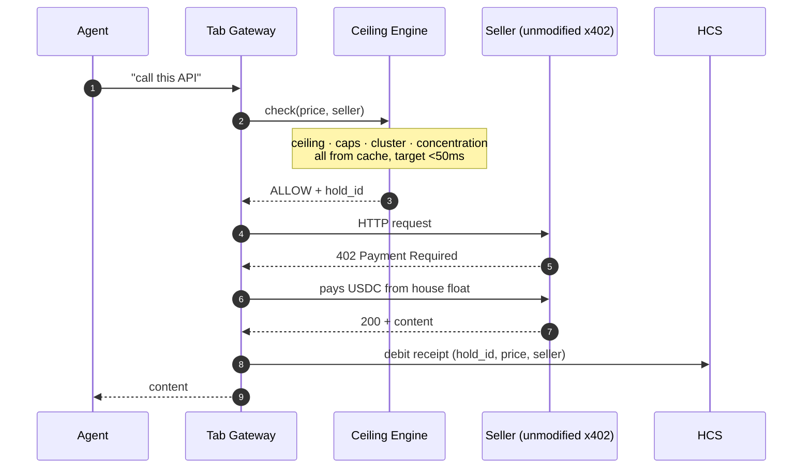
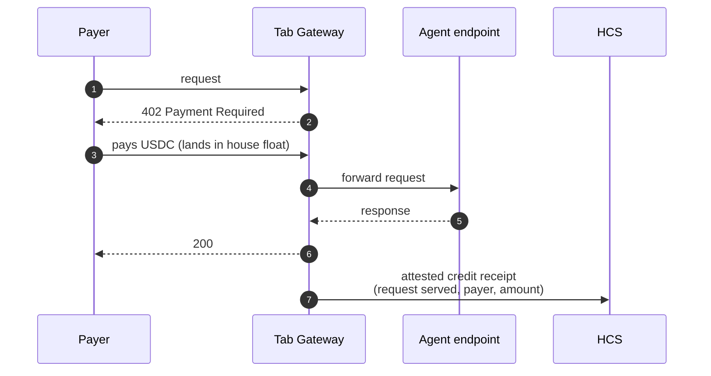
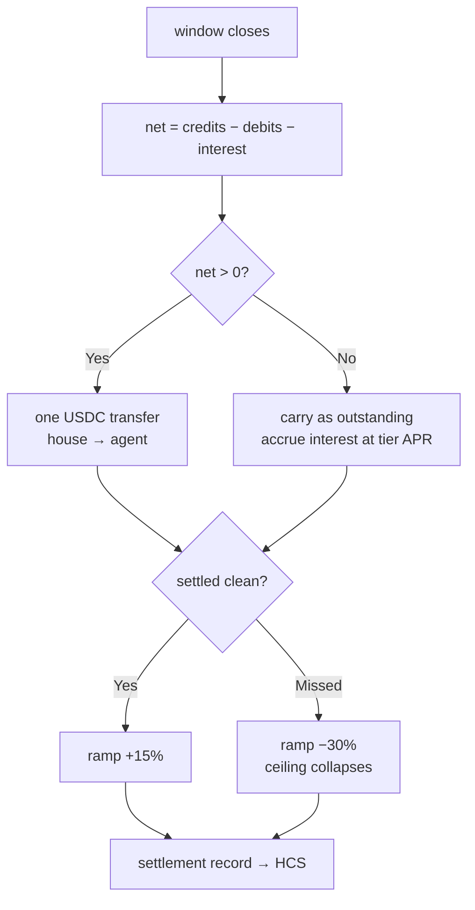
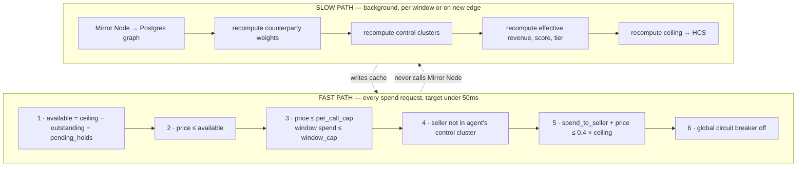
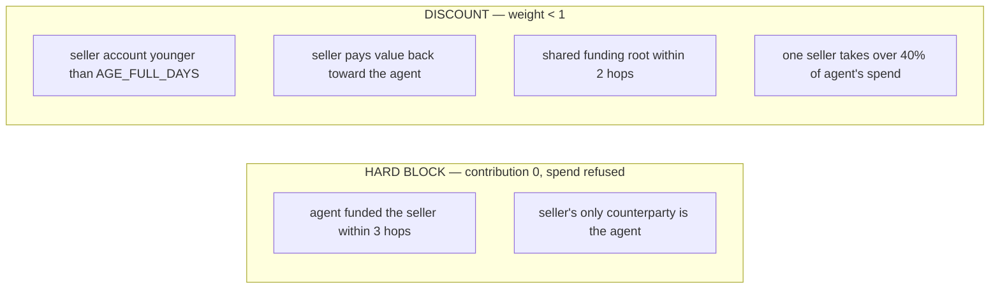
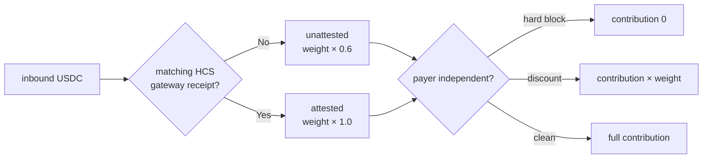
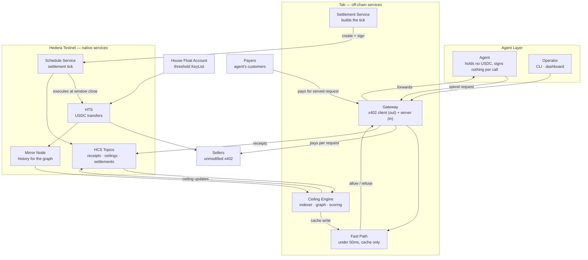
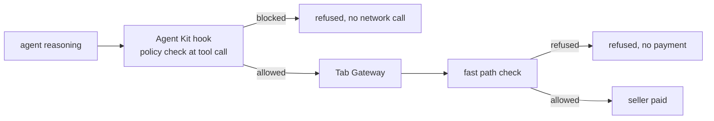
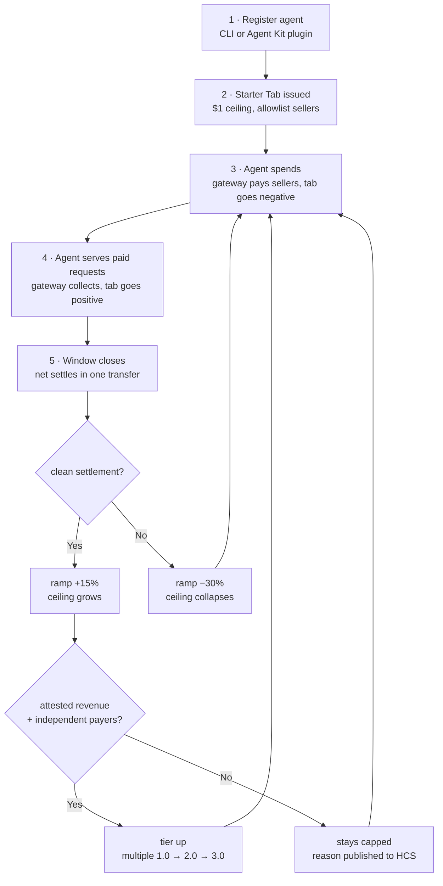

# Tab

**Agents shouldn't need a wallet to do business.**

Tab is a running balance for autonomous agents. It goes negative when the agent spends, positive when it earns, and settles once per window in a single transfer. The agent never holds USDC, never signs a payment, never borrows and never repays. It just spends and earns.

The ceiling on how negative that balance can go is the credit product.

Built for ETHOnline 2026 · Hedera Testnet · **Zero Solidity**

---

## Table of Contents

- [The Problem](#the-problem)
- [Why Now](#why-now)
- [The Solution](#the-solution)
- [Why Hedera](#why-hedera)
- [The Three Flows](#the-three-flows)
- [The Ceiling Engine](#the-ceiling-engine)
- [Attested Revenue](#attested-revenue)
- [The Starter Tab](#the-starter-tab)
- [Architecture](#architecture)
- [Agent Surface](#agent-surface)
- [User Flow](#user-flow)
- [Tracks and Justification](#tracks-and-justification)
- [No Solidity: Contracts Replaced by Native Primitives](#no-solidity-contracts-replaced-by-native-primitives)
- [Tech Stack](#tech-stack)
- [Repository Structure](#repository-structure)
- [Getting Started](#getting-started)
- [Phase 0: Probes](#phase-0-probes)
- [Correctness and Failure Handling](#correctness-and-failure-handling)
- [Trust and Security Model](#trust-and-security-model)
- [Attack Catalogue](#attack-catalogue)
- [What We Deliberately Did Not Build](#what-we-deliberately-did-not-build)
- [Roadmap](#roadmap)
- [Demo](#demo)

---

## The Problem

The agentic economy has payment rails. It does not have **credit rails**.

x402 solved "how does an agent pay." Any service can charge per request; any agent can pay per request. That part is settled.

What is not solved is **sequence**. An agent pays for inference, data, and APIs *before* anyone has paid it. Its balance is structurally behind its earning capacity, and the only fix on offer today is "put USDC in a wallet first."

That fix has four failure modes:

| Failure mode | What actually happens |
|---|---|
| **Cold start** | A freshly deployed agent cannot transact at all until a human funds it. Its first act is to fail. |
| **Job rejection** | The agent declines profitable work because it can't fund the input cost right now. |
| **Human bottleneck** | An operator tops up the wallet by hand — which defeats the point of autonomy. |
| **Hot float** | The operator over-funds "just in case," leaving a large balance in a key that an agent controls. |

Traditional lending can't serve this: an agent has no legal identity and no credit file. Over-collateralised DeFi can't either — it requires the agent to already hold the capital it is trying to borrow.

**The missing primitive is uncollateralised, revenue-underwritten, machine-speed credit.** Not a loan. A tab.

---

## Why Now

Agent deployment platforms are shipping across every major ecosystem — chat-to-deploy tooling, managed agent wallets, spend limits, reputation scores. The category is real and it is funded.

Every one of them ends onboarding with the same instruction: *send the agent money.* Until a human does, the agent cannot execute a single transaction.

That is not a UX bug. It is a missing financial primitive, and no amount of deployment tooling fixes it.

**Tab is the layer underneath.** It is not another agent platform. It is the credit rail those platforms plug into — the reason an agent can be economically active from its first block instead of its first bank transfer.

---

## The Solution

Tab removes the wallet.

A gateway sits in front of the agent on **both** legs of its economic life. When the agent buys, the gateway pays the seller from house float and debits the tab. When the agent sells, the gateway fronts its endpoint, collects payment, and credits the tab. Once per window, the net settles in one transfer.

Four consequences, each of which is a design decision and not a side effect:

### 1. The agent holds nothing, so there is nothing to steal or misdirect
No agent key holds spendable value. A compromised agent can request spends; it cannot make them. The blast radius of a prompt injection is "the gateway refused."

### 2. The gateway sees every spend *before* it happens
This is the core difference from every other agent credit design. Lend-then-hope systems underwrite once and discover problems at repayment. Tab is in the path of every payment and can refuse in-flight, mid-window, on the call that would have caused the loss.

### 3. Revenue is attested, not inferred
Because Tab is the resource server on the earn leg, it *knows* an inbound payment corresponds to a request it served. Reading a chain's transfer history only tells you money arrived. See [Attested Revenue](#attested-revenue).

### 4. Ten thousand calls become one transfer
Per-request settlement is netted per window. The economics of micropayment credit only work if the bookkeeping is free and the settlement is cheap.

**The verbs matter.** The agent does not borrow and repay. It spends and earns. The credit object is not a loan with a term — it is a ceiling on a running balance. That is how trade credit has always worked between businesses, and it fits agents better than a loan ever will.

---

## Why Hedera

This design is not portable. Each property below is load-bearing.

### HCS gives you a clearing ledger without writing one
An append-only, consensus-ordered, timestamped log at roughly $0.0001 per message. Every receipt, ceiling change, and settlement is a message. On any other chain this is a contract you write, audit, and pray over. **Here the audit trail is a native primitive, which is why Tab ships with no smart contracts at all.**

### Sub-cent, USD-denominated fees make per-request payouts real
Sellers get paid per request, immediately, in full. At a fraction of a cent per transfer with a fee predictable in dollars, that is a product. At Ethereum L1 gas it is arithmetic that loses money.

### 3-second finality matches the settlement tick
Window close to settled transfer inside one agent reasoning cycle. No probabilistic finality to wait out before updating a ceiling.

### Mirror Node collapses the data layer
One free REST API with full history. `created_timestamp` on the accounts endpoint gives exact account age instead of a first-operation heuristic — which matters directly, because account age is an input to Sybil scoring.

### x402 works natively on `hedera:testnet`
Both legs of the gateway speak the same standard, so any unmodified x402 seller is reachable and any x402 buyer can pay the agent.

### Scheduled Transactions execute the settlement tick without a keeper
HIP-423 added an optional `expiration_time` to `ScheduleCreateTransaction` — defaulting to 30 minutes, supported out to roughly two months — plus a `wait_for_expiry` flag that makes the transaction evaluate at expiry rather than when signatures arrive. The window's settlement transfer is created at window open and executed by consensus at window close.

**What we do not claim:** this is not cron and not recurring billing. A schedule fires once and expires. Each window creates its own.

---

## The Three Flows

### Spend leg — the agent pays for something



The seller sees an ordinary x402 customer. It does not know Tab exists. **Nothing on the seller side changes.** That property is the strongest line in the project and it must not be traded away.

### Earn leg — the agent gets paid



### Settlement tick — once per window



---

## The Ceiling Engine

The only genuinely novel engineering in the project. Everything else is assembly.

### Formula

```
ceiling = trailing_attested_revenue_per_window
        × tier_multiple
        × ramp_factor
        , clamped by hard_cap[tier]

  tier_multiple    A = 3.0   B = 2.0   C = 1.0   Unrated = 0
  base APR         A = 6%    B = 8.5%  C = 12%   Unrated = n/a
  ramp_factor      starts 15%, +15% per clean settlement,
                   −30% per missed, clamped [0, 100%]
```

`trailing_attested_revenue_per_window` is effective revenue restricted to inflows with a matching HCS gateway receipt, averaged over the last N windows. Unattested inflows — plain USDC that arrived without a served request — count at a **0.6 discount**, because nobody can prove a purchase happened.

Tier derives from bands on effective revenue plus a counterparty-diversity bonus plus settlement history. **Any default collapses the agent to Unrated**, which sets `tier_multiple = 0` and therefore the ceiling to zero.

### Two paths, deliberately different speeds



**Architectural ban:** the fast path never touches Mirror Node. Reads come from memory and Redis only. This is a hard rule, not a performance target — one accidental network call in the hot path and the latency budget is gone.

**Asymmetry rule:** the slow path may **shrink** a ceiling mid-window, instantly. It may **never grow** one mid-window. Shrinking is a safety action; growing is a trust action and waits for a clean settlement.

### Control cluster detection

The independence engine asks a different question here than in a lending protocol. A lender asks *"is this payer independent of the agent?"* Tab asks that on the earn leg **and** asks *"is this seller independent of the agent?"* on the spend leg. Same graph, same math, both directions.



**Testnet calibration note:** on a testnet, every account is young, so a naive age factor rejects everyone. `AGE_FULL_DAYS` is tuned down for the demo environment and the tuned value is printed in the config dump and stated in the video. Do not hide this — state it, because a judge who spots an unexplained tuning knob assumes worse.

---

## Attested Revenue

The single strongest underwriting claim in the project, and the one most easily overstated.

**What attestation proves:** an inbound payment corresponded to a request the gateway actually served. Tab was the resource server. There is an HCS receipt with the request hash, the payer, the amount, and a consensus timestamp. Chain-history-only underwriting cannot produce this — it sees USDC arrive and infers the rest.

**What attestation does not prove:** that the payer was a real, independent buyer. An attacker can stand up a fake buyer that pays for genuine requests. Attestation raises the cost of faking revenue from *"send yourself money"* to *"stand up a buyer, fund it from a source that doesn't trace back to you, and pay for real served requests at real prices"* — but it does not close the hole.

**Which is why both layers ship.** Attestation establishes that a transaction happened; the independence engine establishes that the counterparty is real. Neither is sufficient alone, and we say so in the README rather than letting a judge find it.



---

## The Starter Tab

A gap that pure revenue underwriting cannot close on its own: a brand-new agent has zero attested revenue, therefore a ceiling of zero, therefore cannot spend, therefore cannot do the work that would earn it revenue. The cold start is circular.

**Starter Tab** breaks the circle. Every newly registered agent receives a hard-capped bootstrap ceiling — small enough that abuse is uneconomic, large enough to fund a first job.

| Parameter | Value | Reason |
|---|---|---|
| Starter ceiling | $1.00 | Below the cost of the Sybil setup needed to farm it |
| Per-call cap | $0.05 | Forces many small calls, gives the graph signal to work with |
| Sellers | Allowlist only | No arbitrary spend before any history exists |
| Graduation | First clean settlement with ≥1 attested credit | Real revenue, not just a repaid float |
| One per funding root | Enforced by the graph | Spinning up 100 agents from one wallet yields one Starter Tab, not 100 |

That last row is what makes it safe. The natural attack is to mint agents in bulk and harvest $1 each; the funding-root check makes the yield constant rather than linear in agent count.

**This is also the demo's opening move.** An agent that has existed for thirty seconds pays for something. That is a stronger first thirty seconds than any dashboard.

---

## Architecture



**Where the state lives — and why there is no contract.**

| State | Lives in | Verifiable by |
|---|---|---|
| House float | Account balance | Mirror Node, anyone |
| Every debit and credit | HCS receipt topic | Replay the topic, anyone |
| Current ceiling + inputs | HCS ceiling topic | Recompute and check the hash, anyone |
| Net position | Sum of the receipt topic | Replay, anyone |
| Settlement history | HCS settlement topic + transfers | Both, anyone |

The invariant `float_balance == float + outstanding` is checkable by a stranger from Mirror Node plus an HCS replay. A smart contract would assert the same invariant in a test only we run.

---

## Agent Surface

Tab is only useful if an agent can reach it without a human in the loop. Four surfaces, one core SDK, and the Hedera Agent Kit is load-bearing in two distinct ways.

### 1. Agent Kit plugin — the distribution play
Tab ships as a **Hedera Agent Kit v4 plugin**. Any agent already built on Agent Kit gains a tab by installing it: `spend`, `quote`, `balance`, and `ceiling` appear as tools. No wallet provisioning, no funding step. This is why the plugin exists rather than a bespoke integration — it makes Tab adoptable by the ecosystem the bounty is trying to grow.

### 2. Agent Kit hooks — the second enforcement layer
Agent Kit's hook and policy system lets Tab enforce **at the tool boundary**, before a spend request even reaches the gateway. Two layers of defence at different levels of the stack:



A prompt-injected agent is stopped at the hook. A compromised or bypassed hook is stopped at the gateway. Neither layer trusts the other.

### 3. MCP server
`spend`, `quote`, `balance`, `ceiling`, `receipts` as MCP tools, so an agent in any MCP-capable runtime can transact on a tab with no bespoke code.

### 4. CLI and SDK
`npx @tab/cli` for operators — register, inspect ceiling, dump receipts, force a settlement in demo mode. TypeScript SDK underneath everything above.

---

## User Flow



**Dashboard views:**

| View | Contents |
|---|---|
| **Tab** | Live balance, ceiling, available, pending holds, window countdown |
| **Ceiling** | Current ceiling with every input broken out, tier, ramp, model version, verify button |
| **Counterparties** | Per counterparty: weight, why counted, why discounted, why rejected |
| **Receipts** | Live HCS receipt stream, both legs, with request hashes |
| **Settlements** | Window history, net amounts, ramp changes |
| **Refusals** | Every refused spend with the exact rule that fired |

The **Refusals** view is not an error log. It is the product demonstrating that it works.

---

## Tracks and Justification

### Primary — AI & Agentic Payments on Hedera

| Requirement | How Tab satisfies it |
|---|---|
| AI agent or multi-agent system executing a payment on Hedera Testnet | Every spend-leg call is an on-chain USDC payment to a real seller; every settlement tick is another |
| Uses Hedera Agent Kit, x402, A2A, ACP, or Hedera SDKs | **All three of the first:** Agent Kit v4 plugin + hooks, x402 on both legs, Hedera JS SDK throughout |
| Public repo with README covering setup, architecture, payment flow | This document |
| ≤5-minute demo video of autonomous payment actions | See [Demo](#demo) |

**Optional enhancements — each load-bearing, none bolted on:**

| Enhancement | Why it is structural |
|---|---|
| **x402 pay-per-request** | Both legs of the gateway. Remove it and there is no product. |
| **HTS token operations** | Every seller payout and every settlement is an HTS transfer. |
| **HCS audit trails** | HCS *is* the ledger. There is no other accounting store. |
| **Scheduled Transactions** | The settlement tick executes by consensus, not by a cron we run. |
| **Hedera Agent Kit** | Distribution surface and the outer enforcement layer. |
| **Multi-agent settlement** | Agent pays sellers; agent's payers pay it. Agent-to-agent, no human. |
| **On-chain agent identity (HCS-14)** | Bonus tier — ties the credit record to a portable UAID so defaults survive redeployment. |

**The differentiated claim:** other submissions will show that an agent *can* pay. Tab shows an agent transacting **with no wallet at all** — spending money it does not have, at a ceiling underwritten by revenue the gateway can attest to, and being **refused mid-window** when the graph catches a self-dealing seller. Refusal is the demo. Almost nobody demos the attack that breaks their own design.

**Network impact, measured:** [docs/NETWORK_IMPACT.md](docs/NETWORK_IMPACT.md) — the transaction
profile per unit of work, real fee medians read from Mirror Node's `charged_tx_fee` on our own
transactions, what scales and what does not, and the fee floor (~1¢ per call) below which the whole
pattern stops making sense.

### Secondary — "No Solidity Allowed" — Build with Hedera SDKs

| Requirement | How Tab satisfies it |
|---|---|
| Hedera JS/TS SDK, no Solidity contracts | Zero contracts. Zero `.sol` files. CI fails the build if one appears. |
| At least two native Hedera services | **Four:** HCS, HTS, Schedule Service, Mirror Node |
| Public repo with setup and usage README | This document |
| ≤5-minute demo video | Same demo covers both tracks |

**Why there is no contract, stated as a design argument rather than a constraint.** An earlier draft of this system put float, ceiling, and net position in a Solidity contract. We removed it, because the agent holds nothing — there is no unauthorised spend for a contract to prevent. The contract was recording, not enforcing, and HCS records better: ordered by consensus, replayable by anyone, no bytecode, no reentrancy surface, no upgrade key.

**The enforcement is at the gateway because the money is at the gateway.** Pretending otherwise with a contract would have been theatre.

---

## No Solidity: Contracts Replaced by Native Primitives

| Would normally be a contract | Tab native primitive | Why it's better |
|---|---|---|
| `TabContract.sol` — net position | HCS receipt topic | Consensus-ordered, replayable by anyone, no upgrade path to abuse |
| `CeilingRegistry.sol` | HCS ceiling topic + input hash | Independently recomputable; a contract can't prove *why* a ceiling changed |
| Float custody | Account with threshold `KeyList` | No reentrancy, no vault exploit class |
| Keeper / Chainlink Automation | Scheduled Transactions (HIP-423) | Executed by consensus, not a bot we run and pay for |
| `InterestModule.sol` | Arithmetic on the settlement tick | The tick is one transfer; interest is a term in it |
| Event indexer / subgraph | Mirror Node REST API | Already indexed, already free |
| Foundry invariant test | `pnpm verify-tab` | The same invariant, checkable by a stranger instead of by our own test suite |

**Attack surface removed:** no reentrancy, no delegatecall, no proxy storage collision, no unchecked external call, no upgrade key, no liquidation MEV.

---

## Tech Stack

**Chain and protocol**
- Hedera Testnet
- `@hashgraph/sdk` — transfers, HCS, Schedule Service, accounts
- Mirror Node REST API — history for the graph, background only
- x402 on `hedera:testnet` — both gateway legs
- Hedera Agent Kit v4 — plugin, tools, hooks
- HCS-14 UAID — bonus tier agent identity

**Backend**
- Node.js + TypeScript
- Fastify — gateway (both legs), engine API
- Redis — fast-path cache, pending holds
- PostgreSQL — counterparty graph, read models. **HCS is the source of truth**
- BullMQ — Mirror Node indexing, window ticks

**Frontend**
- Next.js 15 + TypeScript
- Tailwind + shadcn/ui
- TanStack Query
- Live HCS receipt stream via SSE

**Agents (demo)**
- `honest-agent` — spends across three unmodified x402 sellers, serves its own paid endpoint
- `loop-attacker` — second operator, buys from a seller it controls

**Explicitly not used:** Solidity, Foundry, Hardhat, any EVM tooling.

---

## Repository Structure

```
tab/
├── packages/
│   ├── gateway/            # x402 both legs, HCS receipt writer, hold manager
│   ├── engine/
│   │   ├── indexer/        # Mirror Node → Postgres
│   │   ├── graph/          # funding ancestry, control clusters
│   │   ├── scoring/        # tier, effective revenue, ceiling
│   │   └── fastpath/       # the sub-50ms check, cache only
│   ├── settlement/         # window tick, scheduled transaction builder
│   ├── sdk/                # TypeScript client
│   ├── mcp/                # MCP server
│   ├── agentkit-plugin/    # Hedera Agent Kit v4 plugin + hooks
│   └── shared/             # HCS message schemas, types
├── apps/
│   ├── cli/                # npx @tab/cli
│   └── dashboard/          # Next.js
├── agents/
│   ├── honest-agent/
│   └── loop-attacker/
├── scripts/
│   ├── bootstrap-topics.ts
│   ├── verify-tab.ts       # replay HCS, check float invariant
│   ├── verify-ceiling.ts   # recompute a published ceiling, check hash
│   └── seed-history.ts
└── docs/
    ├── probes.md           # Phase 0 results — written before anything else
    ├── ARCHITECTURE.md
    ├── SCORING.md
    ├── HCS_SCHEMAS.md
    ├── ATTACKS.md
    └── KEYS.md
```

---

## Getting Started

```bash
git clone https://github.com/<org>/tab
cd tab
pnpm install
cp .env.example .env
```

```bash
HEDERA_NETWORK=testnet
HEDERA_OPERATOR_ID=0.0.xxxxx
HEDERA_OPERATOR_KEY=302e...

FLOAT_ACCOUNT_ID=0.0.xxxxx
FLOAT_KEY_LIST=...

TOPIC_RECEIPTS=0.0.xxxxx
TOPIC_CEILINGS=0.0.xxxxx
TOPIC_SETTLEMENTS=0.0.xxxxx

USDC_TOKEN_ID=0.0.429274        # testnet USDC — confirm in Phase 0
X402_FACILITATOR_URL=https://api.testnet.blocky402.com
MIRROR_NODE_URL=https://testnet.mirrornode.hedera.com

WINDOW_SECONDS=3600             # 300 in demo mode
AGE_FULL_DAYS=7                 # tuned down for testnet — see SCORING.md
STARTER_CEILING_USDC=1.00
```

```bash
pnpm probe               # Phase 0 — run this first, writes docs/probes.md
pnpm bootstrap           # create HCS topics, associate tokens
pnpm dev:gateway
pnpm dev:engine
pnpm dev:dashboard       # http://localhost:3000
pnpm demo:honest         # 40 paid calls from an empty account
pnpm demo:attack         # loop attacker, refused mid-window
pnpm verify-tab          # replay HCS, assert float invariant
pnpm verify-ceiling --seq 42
```

---

## Phase 0: Probes

**Nothing else starts until these four are green and written into `docs/probes.md`.** Each has a fallback decided in hour one, not hour twenty.

| # | Probe | Fallback if it fails |
|---|---|---|
| 1 | Obtain testnet USDC on Hedera (Circle faucet, Hedera portal, Discord) | Mint our own 6-decimal HTS token. Costs one line in the pitch, nothing structural. |
| 2 | `curl <facilitator>/supported` — confirm `hedera-testnet` and which asset | Self-facilitate using the Hedera exact scheme. Protocol support and live facilitator support are not the same thing. |
| 3 | Associate an account with the HTS token and receive a transfer | Explicit association in bootstrap, or set auto-association slots. **This fails silently if skipped and has no Solana or Stellar equivalent.** |
| 4 | One Mirror Node history query with an explicit timestamp range | Walk history in explicit 60-day chunks; expect 100 rows per page and a few seconds of lag behind finality. |

---

## Correctness and Failure Handling

The parts that decide whether this reconciles to the cent or doesn't.

### Holds and the write-ahead order
A spend must never pay a seller without a recorded debit, and must never record a debit without paying. The order is fixed:

1. **Reserve** — fast path issues a `hold_id`, decrements available immediately. Holds expire after 60s.
2. **Pay** — gateway pays the seller. `hold_id` is the idempotency key; a retry with the same key never double-pays.
3. **Commit** — hold converts to a debit, receipt written to HCS.

Crash between 2 and 3 leaves a hold and a transfer with no receipt. The reconciler catches this by diffing Mirror Node outbound transfers against the receipt topic on every window close, and writes a repair receipt. **This diff is also the demo's proof of reconciliation** — run it on camera.

### Failure matrix

| Failure | Behaviour |
|---|---|
| Seller returns 402 then never delivers | Payment already made; debit stands, dispute flagged to HCS. v1 does not arbitrate — stated openly. |
| Gateway crashes mid-spend | Hold expires; reconciler repairs from Mirror Node diff. |
| Agent net-negative at window close | Carried as outstanding, interest accrues at tier APR, ramp −30%. |
| Missed settlement twice consecutively | Tier collapses to Unrated, ceiling to zero, agent frozen. |
| Mirror Node lagging or paging out | Slow path only. Ceiling holds at last computed value; fast path unaffected. |
| Facilitator down | Spend leg refuses cleanly with a typed error. Earn leg queues. |
| Redis lost | Fast path fails closed — refuses all spends. **Never fails open.** |

**Fail closed, always.** A refused spend costs the agent a job. An allowed spend past a ceiling costs the house real money.

---

## Trust and Security Model

Stated plainly, because a credit product that hides its trust assumptions isn't one.

**What the network enforces**
- Every payment and settlement is a real on-chain transfer, publicly visible
- Receipt ordering is consensus, not our sequence numbers
- Ceiling history cannot be rewritten after the fact
- The float invariant is checkable by anyone via `verify-tab`

**What Tab is trusted for in v1 — the honest list**
- **The float is custodial.** The house holds the money and pays the sellers. This is inherent to the design, not a v1 shortcut: removing the wallet from the agent means somebody else holds it. What we can offer instead of decentralisation is **non-repudiable books** — every movement published to HCS, invariant verifiable by a stranger.
- **The gateway is in the path.** It could refuse a legitimate spend or fail to forward earn-leg revenue. Mitigated by publishing receipts for both legs; an operator can detect divergence and exit. Not prevented.
- **Single signer in v1.** The float account uses a threshold `KeyList`, which is a real improvement over one key and is cheap. It is not a multi-party custody solution.
- **Ceiling computation is off-chain.** Mitigated by publishing the inputs and a pinned model version so anyone can recompute — `verify-ceiling` ships for exactly this.

**Not in scope:** mainnet, real liquidity, KYC/AML, dispute arbitration, or any claim of production readiness.

---

## Attack Catalogue

Published including the gaps, because a catalogue that only lists solved attacks isn't a catalogue.

| Attack | Status | Handling |
|---|---|---|
| Spend at a seller the agent controls | **Caught** | Funding ancestry within 3 hops → hard block |
| Seller whose only counterparty is the agent | **Caught** | Single-counterparty rule → hard block |
| Wash revenue from self-funded payers | **Caught** | Shared funding root → weight discount to zero |
| Fake revenue via plain transfers | **Caught** | Unattested inflows discounted 0.6; no served request, no full credit |
| Concentrating spend at one seller | **Caught** | 40% concentration cap in the fast path |
| Bulk-minting agents to farm Starter Tabs | **Caught** | One Starter Tab per funding root |
| Racing many spends before the ceiling updates | **Caught** | Pending holds decrement available at reserve time, not at commit |
| Sophisticated non-reciprocal collusion ring | **OPEN** | Not caught. A ring where value never flows back and funding roots are properly separated defeats the graph. Cost of mounting it is high; it is not zero. |
| Gateway operator misbehaviour | **OPEN by design** | Custodial. Detectable via published receipts, not preventable in v1. |
| Seller takes payment and doesn't deliver | **OPEN** | v1 records the dispute and does not arbitrate. |

The last three lines are the ones that win points. Say them out loud in the video.

---

## What We Deliberately Did Not Build

| Left out | Why |
|---|---|
| **Smart contracts of any kind** | The agent holds nothing, so there's nothing for a contract to enforce. HCS records better. |
| **A seller-side Tab credential** | The moment a seller must understand Tab, we lose *"works with any unmodified x402 endpoint"* — the strongest property in the design. The tab credential is our own scheme, in our own docs, clearly labelled as not part of x402. |
| **Cross-chain messaging** | Nothing in the loop crosses a chain. |
| **Price oracles** | No collateral to price. |
| **LP vaults and tranching** | Meaningless without real liquidity. House float is honest for v1. |
| **An agent deployment platform** | Tab is the credit layer beneath those, not another one. |
| **Recurring billing framed on Scheduled Transactions** | A schedule fires once and expires. Claiming cron would be wrong and a judge would catch it. |

---

## Roadmap

**v1 — hackathon**
Both gateway legs, ceiling engine with attested revenue and control clusters, Starter Tab, netted settlement via scheduled transaction, Agent Kit plugin + hooks, MCP, CLI, dashboard, honest agent and attacker demos.

**v2 — custody**
Multi-party float control, exit proofs so an operator can withdraw against published receipts without gateway cooperation.

**v3 — identity**
HCS-14 UAID as the primary key so a default survives redeployment and a good record travels across ecosystems.

**v4 — open liquidity**
Third-party float providers taking tranched exposure to published tiers.

**v5 — the credit layer for agent platforms**
Drop-in SDK so any agent deployment platform can offer a funded launch instead of an empty wallet.

---

## Demo

**What actually runs, beat by beat, with measured numbers and the beats that do NOT yet run:**
[docs/DEMO.md](docs/DEMO.md).

**Video:** _(link)_ · **Dashboard:** _(link)_ · **Receipt topic:** _(HashScan)_ · **Ceiling topic:** _(HashScan)_ · **Float account:** _(HashScan)_

```
 0:00  The problem, 20 seconds.
       An agent must pay per request before anyone pays it.
       Someone has to fund the wallet. Tab removes the wallet.

 0:20  Agent registered 30 seconds ago. Zero USDC. Zero balance.
       Starter Tab: $1.00 ceiling.
       It calls a paid API and gets an answer.
       Show the seller paid on-chain. Show the agent signed nothing.

 1:10  THE ATTACK, first pass.
       Second operator points a buyer at a seller it controls.
       First calls clear. Graph flags the control edge.
       Ceiling collapses to zero MID-WINDOW. Spend refused.
       Show the exact rule that fired, on screen. Float untouched.

 2:20  Back to the honest agent, now scaled.
       40 paid calls across 3 unmodified x402 sellers.
       Sellers never knew Tab existed.

 3:10  The agent serves its own paid endpoint to 3 independent payers.
       Tab swings positive. HCS receipt stream, both legs, live.

 3:50  Window closes. ONE netted transfer for 43 calls.
       Run verify-tab on camera. Reconciles to the cent.
       Ramp 15% → 30%.

 4:30  What is NOT solved. Non-reciprocal rings. Custodial float.
       Single signer. No dispute arbitration. Say it out loud.
```

**Why the attack is at 1:10 and not 3:30.** Judges watch dozens of these. Nothing surprising in the first ninety seconds means the submission is remembered as competent rather than as interesting. Break your own design early, then show it working.

No Solidity was deployed at any point.

---

*Built for ETHOnline 2026 — Hedera · AI & Agentic Payments and "No Solidity Allowed" tracks.*
